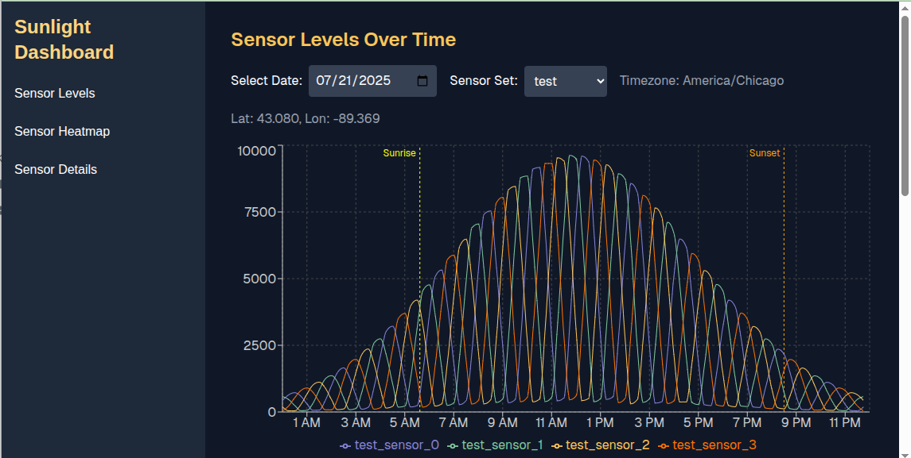

Like many software engineers, the vast majority of the code I've worked on over the course of my career has been proprietary, so I can't make it part of my portfolio.  Unless otherwise stated, projects on this page were done on my own time.

Use of AI has been disclosed where applicable.  The text of this portfolio was written without AI.

## [Sunlight Sensor Project](sunlight-sensor/README.md)

[View the Sunlight Sensor Project](sunlight-sensor/README.md)

An end-to-end data streaming project including:
- ESP32 driven light sensors, using embedded software written in C with ESP-IDF, 
- Google Cloud Run Functions written in Python and Go, acting as data processing scripts and a REST API,
- BigQuery and Firestore data storage,
- Google Pub/Sub event handling,
- Web app for viewing light intensity levels built with React/Next.js/Typescript, hosted on Firebase

<table role="presentation" style="width:100%; border:none;">
  <tbody>
    <tr>
      <td style="text-align:center; vertical-align:top; border:none;">
        
         
        <strong>Prototype light sensor build</strong>
      </td>
      <td style="text-align:center; vertical-align:top; border:none;">
        
         
        <strong>Web Application Screen Shot</strong>
      </td>
    </tr>
  </tbody>
</table>

## A Note to Employers Regarding the Use of AI

[View A Note to Employers Regarding the Use of AI](ANote.md)
