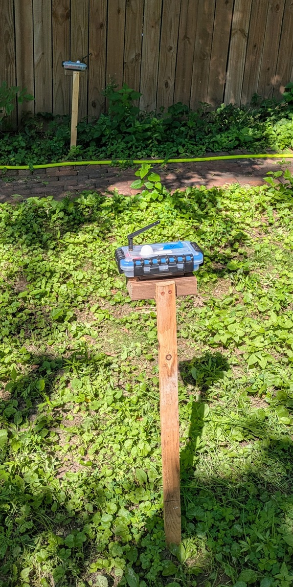

# kden.github.io
Caden Howell's Portfolio

## [Sunlight Sensor Project](sunlight-sensor/README.md)
An end-to-end project based on ESP32 driven light sensors, using embedded software written in C with ESP-IDF, Google Cloud web
services written in Python and Go, BigQuery and Firestore data service, Google Pub/Sub event handling, and a web app for viewing light levesl built with React.

