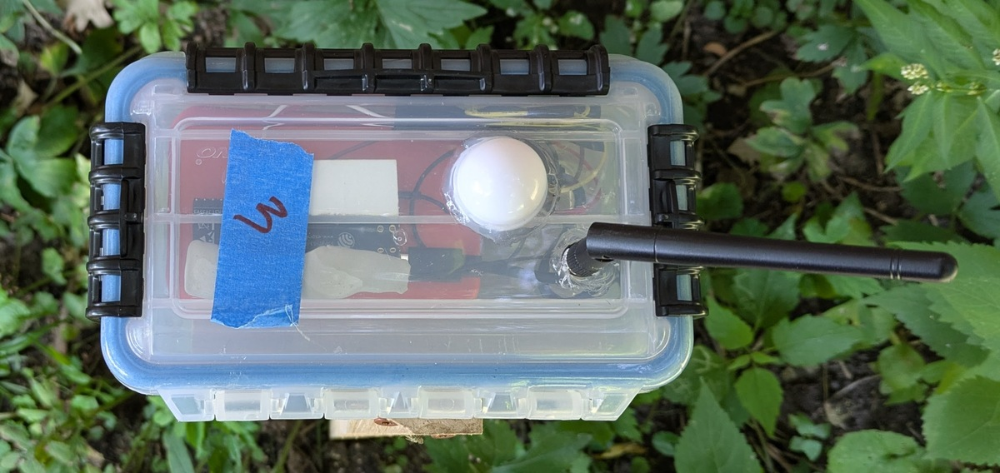

# High-Level Software Architecture

## Minimum Viable Product Build

The minimum viable product build revolves around the data flow of the light intensity data from the sensors.  This flow is described below, as well as the flow for daily weather information from the Open-Meteo API.

<figure style="text-align: center;">
  
  <figcaption><strong>Prototype light sensor build</strong></figcaption>
</figure>

## Light Intensity Sensor Data Flow

<figure>
  
  <figcaption>High level diagram of data flow architecture for light intensity sensors</figcaption>
</figure>

1. The sensor data flow starts with the light sensors.  These sensors are based on ESP32 development boards and the firmware is written in C with the ESP-IDF libraries.  Every 15 seconds, they buffer a light intensity reading.  Every 5 minutes, they send the buffered list of light readings to the Sensor REST API.
2. The sensor REST API accepts the POST requests from the light sensors, which are authenticated with a simple Bearer token.  The API is implemented as a Python Cloud Run function.  It filters out invalid data and sends valid date on to Google Pub/Sub via an authenticated connection.
3. The Google Pub/Sub topic has two subscriptions:
   1. A subscription which sends the data directly to a BigQuery table
   2. A subscription which sends the data to another Cloud Run function, which creates formatted logging messages for Google Cloud Monitoring.
4. BigQuery runs two incremental scheduled query jobs on the incoming data:
   1. Convert the data from Pub/Sub JSON data to columns
   2. Downsample the data so that there is a maximum of one reading per minute.  I experimented with filling in minutes for missing data by carrying the last value forward or using linear interpolation, but there didn't seem to be a benefit to that at this point in our data reporting.
5. Google Cloud Scheduler (like a cron job) triggers another Python Cloud Run function which copies the data to Firestore.  We could have pulled the data for the web UI directly from BigQuery, but BigQuery is better suited for data analytics and warehousing; Firestore is better suited for web applications.  As a part of the function, the data gets downsampled again to one bucket for every 15 minutes.  I did try transferring the full one-reading-per-minute data set, but the UI struggled to load 1440 points.  I used the React profiler and confirmed that this was a bottleneck for the UI.
6. Finally, the user can view the data in the UI application, which reads the sensor data from Firestore.  The UI application is a React application hosted on Firebase.

The combination of Cloud Run functions, Google Pub/Sub (which fulfills the role of a lightweight version of Apache Kafka, if you're unfamiliar with Pub/Sub), and BigQuery allow this architecture to handle a very large number of sensor readings.  Cloud Run functions will scale up automatically, and Pub/Sub will capture and hold on to data until BigQuery can handle it, and smooth out peaks in the incoming data volume.

## Daily Weather Retrieval Data Flow

<figure>
  
  <figcaption>High level diagram of data flow architecture for daily weather</figcaption>
</figure>

The daily weather retrieval data flow is simpler than the sensor data flow.  For one thing, it only runs once a day.  It also only needs to collect data for one sensor set per day, rather than per sensor.  On the other hand, the sensor data flow should be able to handle hundreds of sensors sending data every few minutes or more, depending on how close to real-time we want the system to be.  That's why the daily weather architecture does not use Pub/Sub whereas the sensor architecture does.

1. In the wee hours of the morning, Google Cloud Scheduler triggers a Cloud Run Function written in Go.
2. The Cloud Run function connects to the free Open-Meteo weather API and picks up the weather information from the previous day and the current day.  It picks up the previous day to overwrite that day's reading with the (hopefully) more accurate end-of-day data.  It writes the data to BigQuery.
3. Google Cloud Scheduler triggers another Cloud Run function, which copies the BigQuery data to Firestore.  Again, we could have stored it in only one database, but Firebase is optimized for web apps, and the data will also be useful to have in BigQuery for future data analysis.
4. Finally, the user can view the data in the UI application, which reads the weather data from Firestore.  It uses this data to draw the "sunrise" and "sunset" lines on the Sensor Levels view.