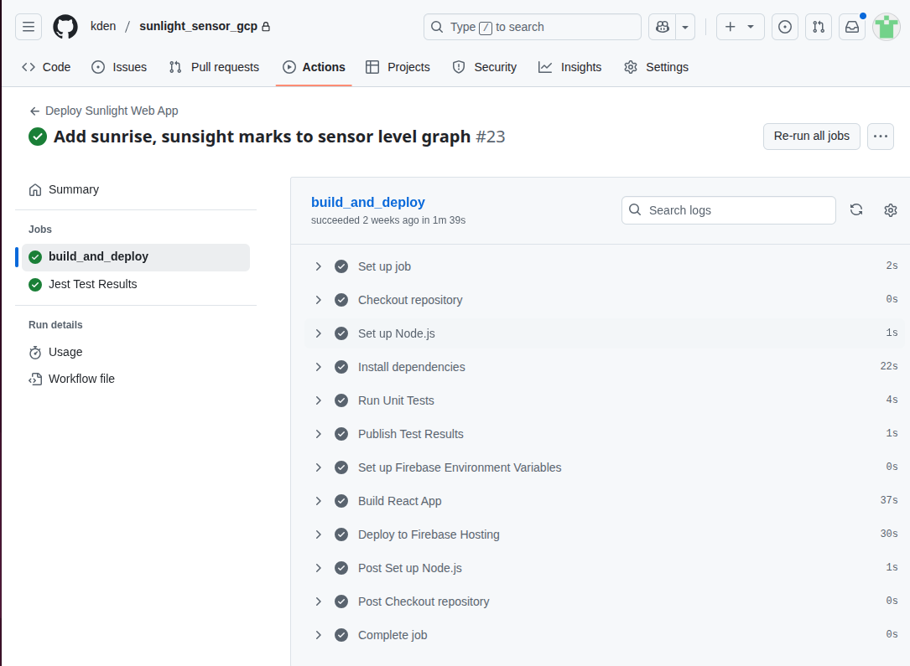
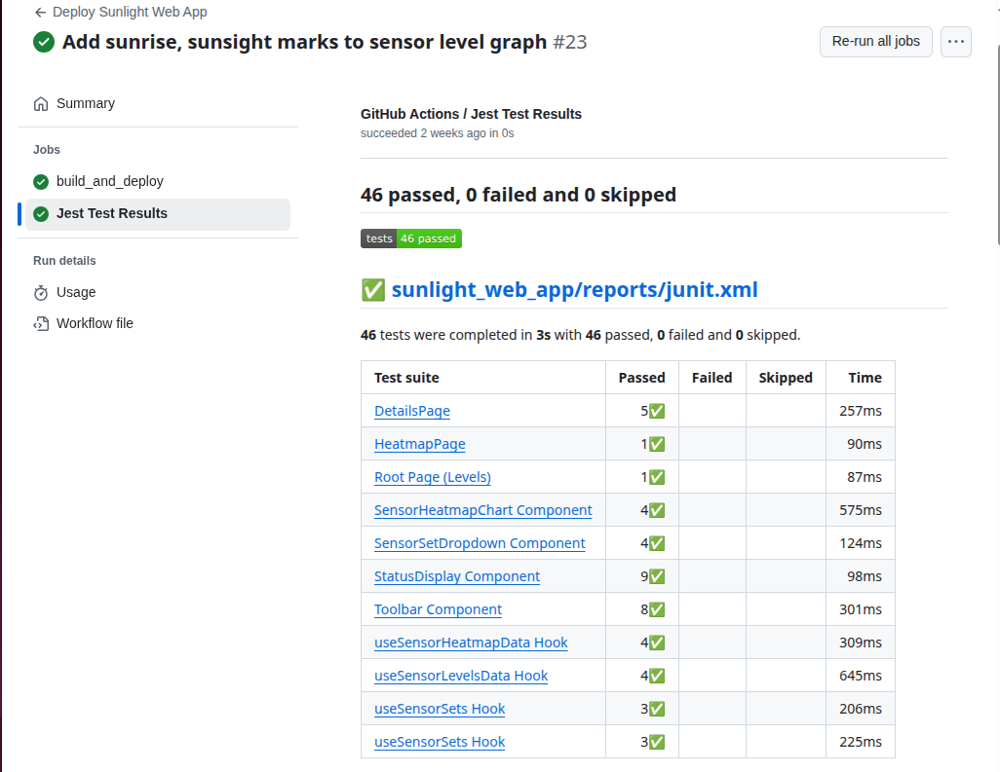

# Continuous Integration and Continuous Delivery (CICD)

This project uses GitHub actions to automatically deploy the React-based webapp and one of the Cloud Run Functions to Google Cloud Platform.  Because this is a portfolio project, and there are not customers dependent on it 24/7, commits to the main source code branch are pushed directly to the production environment.

Basically, if you check a change into the main branch, and it is in the [sunlight_web_app](https://github.com/kden/sunlight_sensor_gcp/tree/main/sunlight_web_app) folder, the web app will get pushed the production by one GitHub action.  If unit tests on the app fail, the application will not be pushed.  The test output is written in JUnit format so that GitHub can read and display it with the build information.  (This is a pretty common way of sharing test results with build systems.)

If you check a change into the [functions/process_sensor_status ](https://github.com/kden/sunlight_sensor_gcp/tree/main/functions/sensor_status_monitor) the sensor status monitor function will be pushed to production by another GitHub action.

# Screenshots
<figure>
  
  <figcaption>GitHub Actions workflow for web app deployment.</figcaption>
</figure>

<figure>
  
  <figcaption>GitHub Actions test results summary.</figcaption>
</figure>

Many of the other Cloud Run Functions are currently deployed by Terraform.  Terraform zips and uploads the code and deploys it that way.  This is not best practice, but was a way to get started, particularly with functions I didn't expect to change frequently.

# How CICD would Scale Up to the Next Level
There are some unit tests throughout the project, but code coverage is currently a work in progress.

If this were a production project, ideally it would minimally:

1. Pass automated unit tests at commit time as part of the build.  A branch could not be merged to main unless the tests pass.

2. Pass some peer code review.

3. Be deployed to a shared QA environment for manual and automated testing.

4. Pass tests including:
   
   1. Functional integration tests
   
   2. Checks for insecure dependencies
   
   3. Licensing checks

5. Be approved for deployment to the production environment.

As the project scales up, it may be helpful to add an additional environment, for example, for demos only that can't be used for testing new code.   (This has been a frequent wish list item at places I've worked.)

