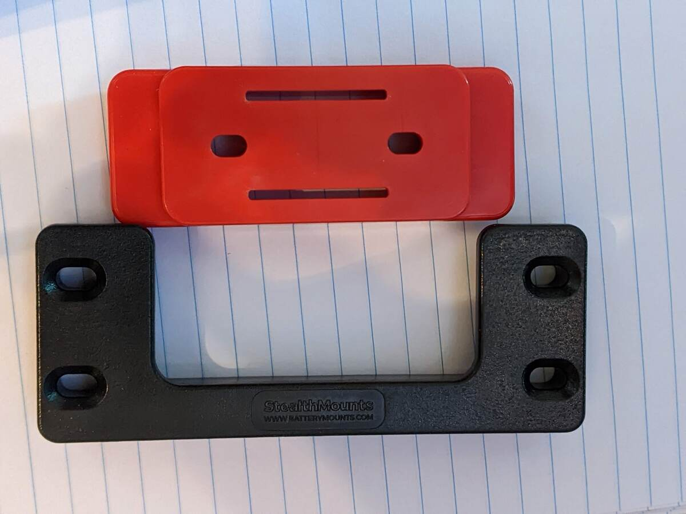

# Enclosure Updates

## Waterproofing

After the first rainstorm with sensors 2 and 3, I found a tiny bit of water pooled in the bottom of each enclosure.

Luckily, the hardware survived, possibly because the ESP32 development board was mounted to the top lid of the enclosure and didn't sit in standing water.  But sadly, the water meant that the enclosures were not waterproof. 

<figure>
  
  <figcaption>Top view of the assembled sensor prototype.</figcaption>
</figure>

The likely culprits were the holes I drilled for the antenna and the light sensor.  They were sealed with Loctite Clear Silicone Waterproof Sealant.  The silicone didn't bond well to the plastic enclosures.  I could not find the type of plastic that the enclosures were made of online, except for one product description that said "polycarbonate".  This is wrong: polycarbonate is rigid.  The containers are probably polyethylene or polypropylene or, since they're not marked for recycling, some blend.

I easily peeled off the silicone. Next I replaced the o-ring with the antenna with a flat rubber washer and metal washer approximately 1/2" in diameter.   SMA antenna screw-type connectors require a 1/4" hole.

<figure>
  
  <figcaption>Right: new rubber washer.  Left: silicone-encrusted o-ring.</figcaption>
</figure>

The sensor was more difficult.  I wish I could have used another o-ring and screw type connection, but the sensor cover is simply a dome with a flat edge along the bottom.  There is a little bit of a lip on the edge, so I decided to try waterproof tape.  [[Amazon]](https://www.amazon.com/Gorilla-Waterproof-Patch-Seal-Clear/dp/B09D8FD4L5/)

<figure>
  
  <figcaption>Gorilla waterproof tape.</figcaption>
</figure>

I cut a hole in a piece of waterproof tape that would cover the lip and placed it over and around the dome.

<figure>
  
  <figcaption>Enclosure with new rubber washer and waterproof tape.</figcaption>
</figure>

The updated waterproofing is currently out in the rain for testing.

## Larger USB Power Supplies

You may have noticed from the previous picture that the antenna has moved and a piece of electrical tape exists in the old location of the antenna.  This is to accommodate new USB power supplies.  The long-term plan is still to investigate power supplies that have no low-current shutoff, but for now, I wanted power supplies that would last at least a day.  The new USB battery packs are 15000mAh.  [[Amazon]](https://www.amazon.com/dp/B0B45GX5V7)  They are a little bit bigger, so the antenna had to be moved, and I had to order new right-angle USB connectors to fit in the enclosure.

I have great faith in the waterproofing abilities of electrical tape after using it to mask off protected parts of tin in an [electrolytic etching project](images/tin_box_etched.jpg) I did some years ago, so that's all I've used to cover the hole for now.  Unfortunately, I couldn't get it to stick to the curve of the light sensor, which is why I used the Gorilla tape to waterproof that.  For now, they're working well.  They last about 2 days and survived getting a little bit of water on them.

## Bolted Feet

The soft plastic of the enclosures also did not bond well with the epoxy I used to attach the feet.  When I removed the enclosure from the cleat, it would just break off, leaving the foot in the cleat.

<figure>
  
  <figcaption>Stealthmounts Cleat and Foot for mounting.</figcaption>
</figure>

<figure>
  
  <figcaption>The fully assembled sensor prototype on its stand.</figcaption>
</figure>

There are clearly holes in the foot to be bolted to something, but I did not want to use them because I wanted as few holes in the enclosure as possible, and over-tightening or pulling on the screws could cause the plastic to crack.  Since these were the attachment point to the stakes, they'd get pulled on a lot.

However, I did some research and found that epoxy is not great at sticking to soft plastic like that of the enclosure. I decided to try the bolts.  I bought some M4 pan-head screws, nuts, washers, and rubber washers and reattached the feet.  So far they are working.