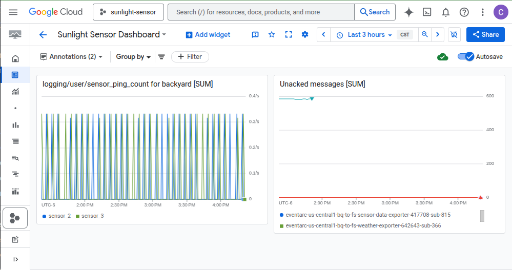
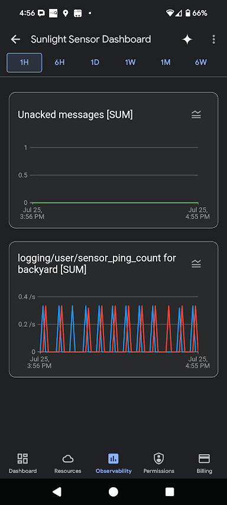
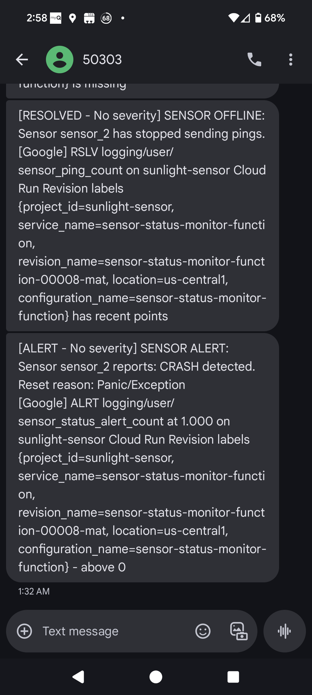
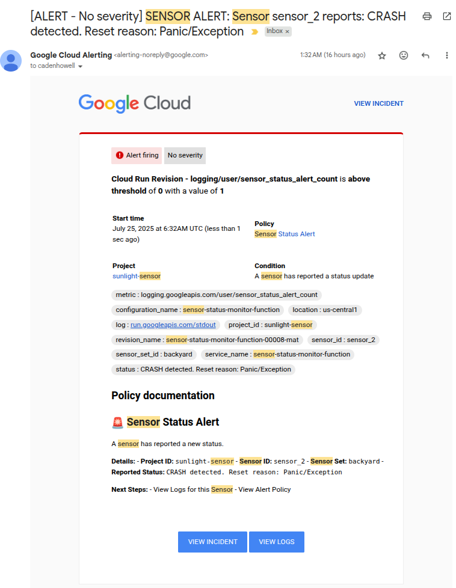
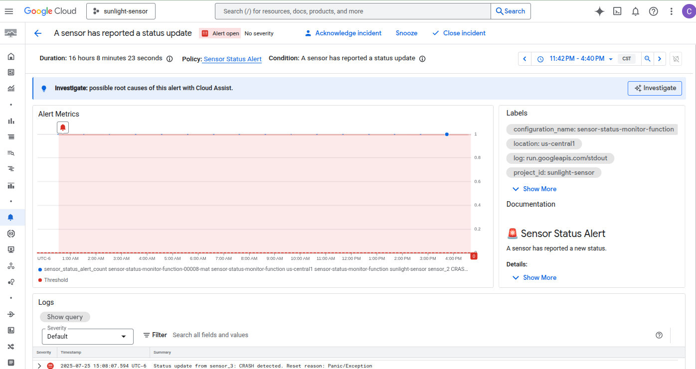
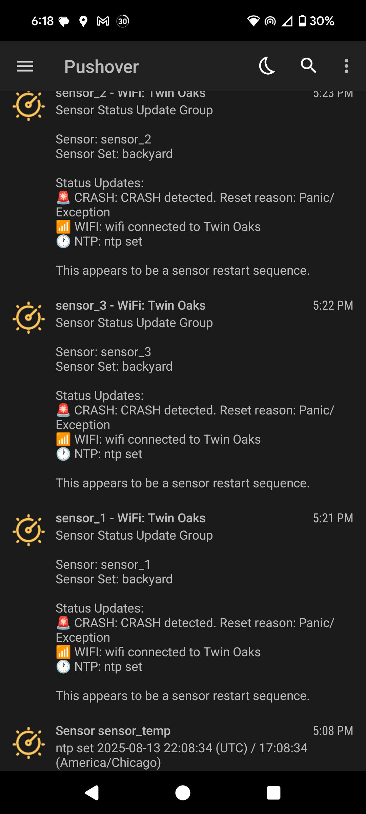

# Monitoring

The Sunlight Sensor system sends me an email and SMS message every time one of the sensors has a significant event like capturing the time from an NTP server, which it does at startup.  It also sends me a message whenever it does NOT get a ping from a sensor for more than 15 minutes.  This was implemented by leveraging Google Cloud Platform's alert and monitoring features.

You can see most of the setup in the [Terraform monitoring file](https://github.com/kden/sunlight_sensor_gcp/blob/main/terraform/monitoring.tf) and the [Cloud Run function that generates the log messages for monitoring](https://github.com/kden/sunlight_sensor_gcp/blob/main/functions/sensor_status_monitor/src/main.py).

Google Cloud Monitoring generates metrics from the log messages produced by the cloud run function.   You can view these metrics in a dashboard as well as send alerts for exceptional conditions.

Here are some screen captures of the monitoring dashboard and messages.  I'm using Google's "off the shelf" products here, so customization is somewhat limited.  In the past I've used Datadog and PagerDuty, and those made it a bit easier to customize messages and alerts.

## Month one Monitoring
<figure>
  
  <figcaption>Google Cloud Monitoring desktop dashboard, showing sensor pings and Pub/Sub traffic.</figcaption>
</figure>

The above dashboard has two charts.  The chart on the left shows that two sensors are firing at regular intervals, which is what we expect.

The chart on the right shows the number of unacked messages in each Pub/Sub subscription.  If this is non-zero or rising, it means that Pub/Sub is publishing messages but nothing is picking them up and processing them.  The teal line that disappears is a test subscription that never processed messages, and you can see the line goes away because I deleted it.  The rest of the subscription readings are at zero where they should be.

<figure>
  
  <figcaption>Google Cloud Monitoring mobile dashboard, showing sensor pings and Pub/Sub traffic.</figcaption>
</figure>

At risk of becoming an ad for Google monitoring, here's the same dashboard charts as seen from the Google Cloud Android app.  I just liked that this was available.  

<figure>
  
  <figcaption>Google Cloud Monitoring SMS alert messages</figcaption>
</figure>

Above you can see what the SMS messages look like.  They're very hard to skim, and can't be edited down, only enhanced with more information.  The first message is the one I get if a sensor goes offline for 15 minutes, and the second is telling me that a sensor has just restarted, and the last message in the reset buffer is "Panic/Exception."

<figure>
  
  <figcaption>Google Cloud Monitoring alert email message</figcaption>
</figure>

In the email, you can only personalize the "Policy Documentation" section.  For a production app where you're working with a support team, this is an ideal place to link to a runbook that tells how to diagnose and solve this problem.  However they do automatically include the nice links to the incident and logs pages.

<figure>
  
  <figcaption>Google Cloud Monitoring incident page</figcaption>
</figure>

That link will take you to an automatically created incident page in the Dashboards: Alerting section of Google Cloud console.  There you can acknowledge, close, or otherwise manage the alert.

## Pushover

After setting up the initial alerts, I did not want Google incidents to be created for the status messages I received when the sensors start up and send their initial Wifi connection and NTP setting messages.  The free method we used to have of sending an email that could become an SMS through a gateway provided by a provider, like 9995551212@tmomail.net, was ruined by spammers and has been cut off.  So I found a recommendation for [Pushover](https://pushover.net/), which is an inexpensive option to push alerts to various devices, including my Android phone.

I still receive the "incident" alerts when pings stop for more than 15 minutes as SMS messages and emails, but these status message are now Android push notifications.

It was easy to set up.  Here's what a typical message looks like; you have to install the Pushover app to receive them.

<figure>
  
  <figcaption>Pushover sensor status notifications</figcaption>
</figure>