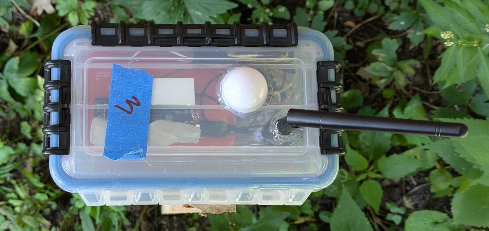

# Sunlight Sensor Project

An end-to-end project data streaming project including:
- ESP32 driven light sensors, using embedded software written in C with ESP-IDF, 
- Google Cloud Run Functions written in Python and Go, acting as data processing scripts and a REST API,
- BigQuery and Firestore data storage,
- Google Pub/Sub event handling,
- Web app for viewing light intensity levels built with React/Next.js/Typescript, hosted on Firebase
- Monitoring and alerting

## Portfolio Project Goals
In presenting this project, I'm hoping to convince you that:
- As an experienced software engineer, I have a good understanding of the software development cycle and the what's involved in developing and deploying production software
- I can quickly learn and contribute to projects using technologies I was previously unfamiliar with, and
- Working with AI tools in a way that benefits your organization requires incremental change and testing to produce reliable results, and tenacity to get to the bottom of problems that AI can't solve.

## Contents
- [Source Code](#source-code)
- [Web Application](#web-application)
- [Concept](#concept)
- [Minimal Viable Product](#minimal-viable-product)
- [Use cases](#use-cases)
- [Minimum Viable Product Build](#minimum-viable-product-build)
- [Architecture](#architecture)
- [Statement regarding the use of AI](#statement-regarding-the-use-of-ai)
- [Nonfunctional Requirements](#nonfunctional-requirements)
- [Sensor Prototype Hardware Builds](#sensor-prototype-hardware-builds)

## Source Code
- [GitHub repository for webapp, Cloud Run functions, and Terraform files for Google Cloud Platform
](https://github.com/kden/sunlight_sensor_gcp)
- [Github repository for firmware for the ESP32-driven light sensor, using ESP-IDF and C
](https://github.com/kden/esp32_sunlight_sensor)

## Web Application

- [Link to the Sunlight Sensor web application.
](https://sunlight.codepaw.com/)

The application has test data under the "Test" sensor set, so you can preview it if the sensors are out for maintenance.

- [Web application screen shots](WebappScreenshots.md)

## Concept

[Permaculture](https://en.wikipedia.org/wiki/Permaculture) is a sustainable approach to land use, emphasizing a self-sustaining, regenerative ecosystem.  Farmers and gardeners are experimenting with permaculture techniques to use land in a way more compatible with natural ecosystems.

One important concept in permaculture planning is [microclimates](https://en.wikipedia.org/wiki/Microclimate).  A microclimate is a small area that has a different climate than the surrounding area. If you have a small yard, but want to incorporate features of different ecosystems, you can find or create microclimates that support different plants and animals.  

To plan what plants to put in a microclimate, you need to know things like the amount of sunlight, humidity, and temperature. Sensors for these conditions have become rather inexpensive, and it's possible that a homeowner or hobby farmer could use them to map their various microclimates.

## Minimal Viable Product

For me, whose idea of gardening is to throw gobs of native plant wildflower seeds around the yard and see what sticks, implementing permaculture is daunting.  I experimented for a few years in replacing our grass with clover as an environmentally friendlier alternative. However, clover doesn't grow well in shady ares.  I also noticed that the raspberries I planted in the sun thrived in comparison to those in the shade.

I decided that sunlight was the most important data for improving the plant health in the backyard.  **The minimal viable product, then, will be a small set of sensors in the backyard that tracks the amount of sunlight in different areas.**  That way I can find the sunniest parts of the yard and take full advantage of their growth potential, while choosing ground cover that tolerates shade for the rest of the hard.

In the future, we can add sensors for temperature and humidity, and larger numbers of sensors, but this will be a good minimal viable product for the end-to-end flow of data.

## Use cases

- As a gardener or small farmer 
  - **I want to be able to look at an app on my tablet or desktop and see what parts of my land get the most sun.**
    - I would like to see the total sun exposure of various parts of the yard over the course of a day, a week, or a month
    - I would like to see the sun exposure of the yard at a specific time.
  - I would like to see the readings on a sensor over the course of a day.
  - I would like a way to see which sensors are down, for example, if they are out of batteries.

## Minimum Viable Product Build

The system starts with data coming in from the sensors, which are ESP32-driven, with embedded code written in C.  They capture the intensity of light with a light sensing component, and send those measurements to a REST API, implemented as a Cloud Run Function in Python.

<figure style="text-align: center;">
  
  <figcaption><strong>Prototype light sensor build</strong></figcaption>
</figure>

The API does some filtering on security and data criteria, and passes that data on to Google Pub/Sub, which passes it on to BigQuery.  Two BigQuery scheduled queries then act as a small ETL pipeline, extracting the data from the Pub/Sub messages, and downsampling it to one reading per minute.

Finally, some CloudRun functions downsample the data to 15-minute aggregations and upload it to Firebase, where it is easily read by the web app.

That is the basic minimum data flow, minus some additions described in [Architecture](Architecture.md)

## Architecture
[Sunlight Sensor project architecture diagrams](Architecture.md)

## Statement regarding the use of AI
[Statement regarding the use of AI in this project
](UseOfAI)

## Nonfunctional Requirements
[Nonfunctional requirements (budgeting and technology constraints)
](Nonfunctional)

## Sensor Prototype Hardware Builds

This was my first embedded software project, so these are a bit more like stories than reference documents.

- [Sensor Hardware V1](SensorHardwareV1)
- [Sensor Hardware V2](SensorHardwareV2)