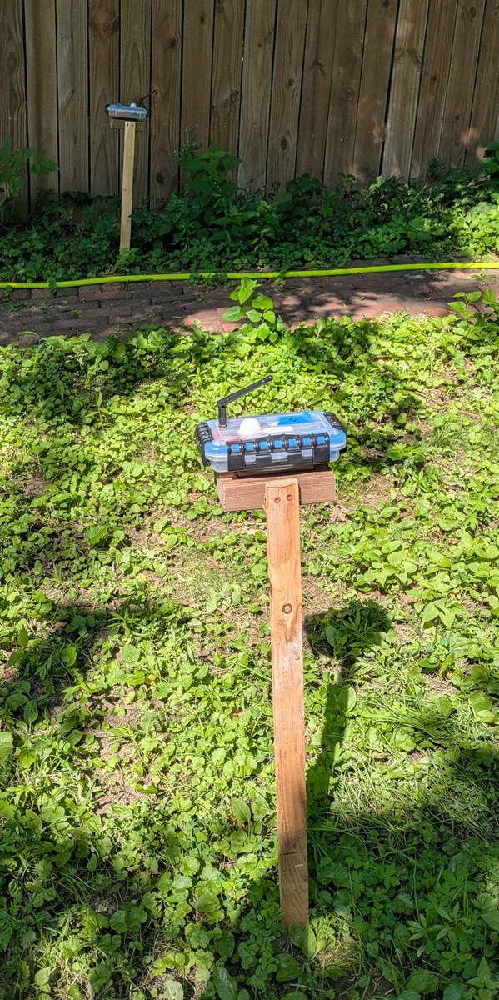

# Sunlight Sensor Project

## Concept

[Permaculture](https://en.wikipedia.org/wiki/Permaculture) is a sustainable approach to land use, emphasizing a self-sustaining, regenerative ecosystem.  Farmers and gardeners are experimenting with permaculture techniques to use land in a way more compatible with natural ecosystems.

One important concept in permaculture planning is [microclimates](https://en.wikipedia.org/wiki/Microclimate).  A microclimate is a small area that has a different climate than the surrounding area. If you have a small yard, but want to incorporate features of different ecosystems, you can find or create microclimates that support different plants and animals.  

To plan what plants to put in a microclimate, you need to know things like the amount of sunlight, humidity, and temperature. Sensors for these conditions have become rather inexpensive, and it's possible that a homeowner or hobby farmer could use them to map their various microclimates.

## Minimal Viable Product

For me, whose idea of gardening is to throw gobs of native plant wildflower seeds around the yard and see what sticks, implementing permaculture is daunting.  I experimented for a few years in replacing our grass with clover as that seemed environmentally responsible. However, clover doesn't grow well in shady ares.  I also bought a number of bare-root raspberry plants.  The ones that I planted beneath trees have been dormant for several years, but the ones I planted in the sun blew up in just a year.  

I decided that sunlight was the most important data for improving the plant health backyard.  **The minimal viable product, then, will be a small set of sensors in the backyard that tracks the amount of sunlight in different areas.**

In the future, we can add sensors for temperature and humidity, and larger numbers of sensors, but this will be a good proof of concept.

## Use cases

- As a gardener or small farmer 
  - **I want to be able to look at an app on my tablet or desktop and see what parts of my land get the most sun.**
    - I would like to see the total sun exposure of various parts of the yard over the course of a day, a week, or a month
    - I would like to see the sun exposure of the yard at a specific time.
  - I would like to see the readings on a sensor over the course of a day.
  - I would like a way to see which sensors are down, for example, if they are out of batteries.

## Minimum Viable Product Build

I've assembled a small number of ESP32-driven sunlight sensors that run on batteries.

And created a React-driven webapp to with the following views:

### Sensor Levels (pictured here with test data)

### Sensor Heatmap

### Sensor List

For more information, click on the following links.

[Statement regarding the use of AI in this project
](Statement_Regarding_Use_of_AI.md)

[GitHub repository for webapp, including Terraform files for Google Cloud Platform
](https://github.com/kden/sunlight_sensor_gcp)

[Github repository for firmware for the ESP32-driven light sensor, using ESP-IDF
](https://github.com/kden/esp32_sunlight_sensor)

[Nonfunctional requirements (budgeting and technology constraints)
](Nonfunctional_Requirements_and_Constraints.md)

[Architecture Diagram](Architecture.md)

[Sensor Hardware V1](Sensor_Hardware_v1.md)

[Sensor Hardware V2
](Sensor_Hardware_v2.md)