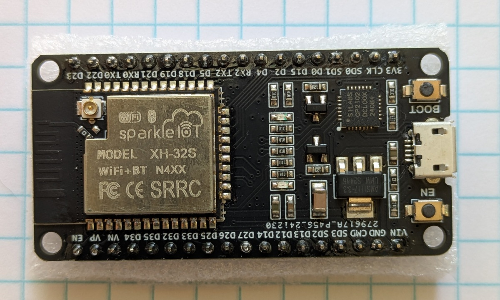
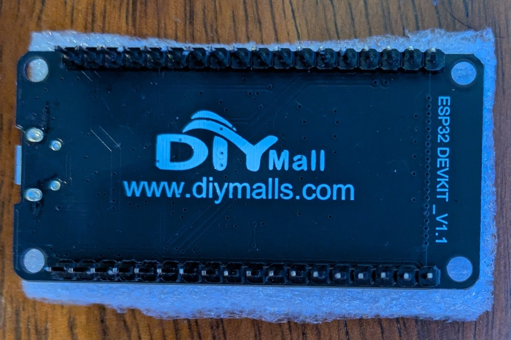
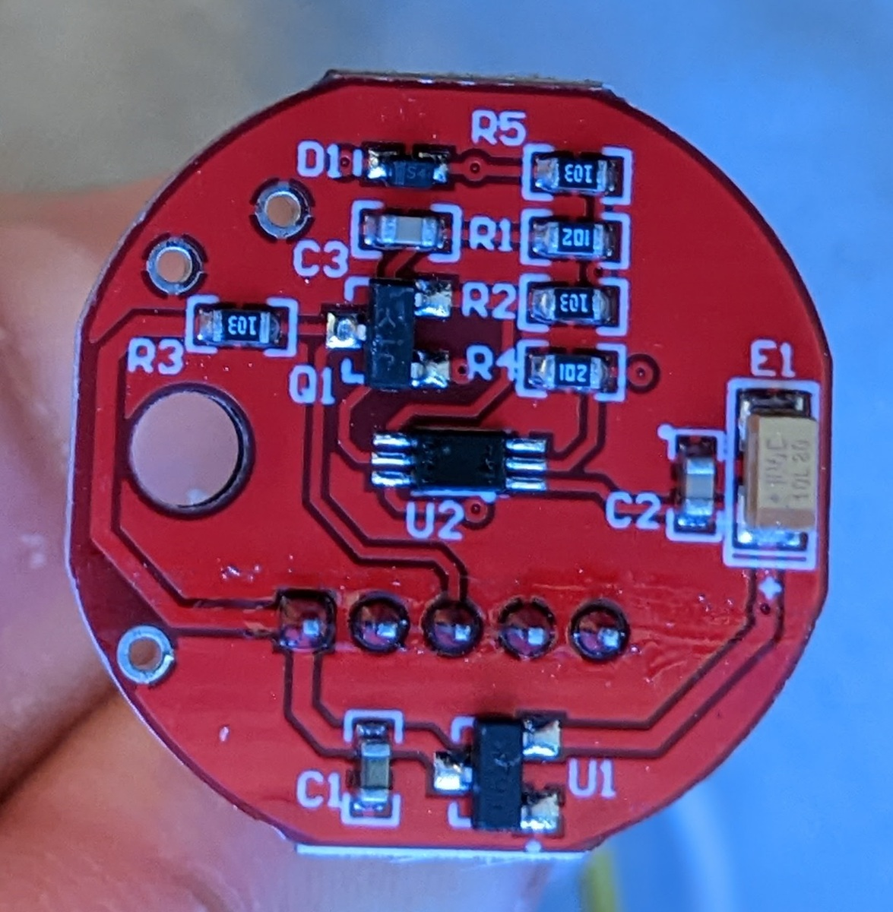

# Sensor Hardware V1

All of the code used to program the ESP32 boards is in the project [esp32_sunlight_sensor](https://github.com/kden/esp32_sunlight_sensor).

This was my first embedded software project, so this document is as much as a description of the learning process as a reference for the actual hardware.

## Components

I started putting together the first version of the sensor hardware with the cheapest ESP32 board that I thought would meet my needs.  I bought the ESP32 DEVKIT V1.1 - DOIT from DIYMALL via [Amazon](https://www.amazon.com/dp/B084KWNMM4). 

<figure>
  
  <figcaption>ESP32 DEVKIT V1.1 - DOIT</figcaption>
</figure>

<figure>
  
  <figcaption>Back of ESP32 DEVKIT V1.1 - DOIT</figcaption>
</figure>

For the light sensor, I used a BH1750FVI type with a light diffusion dome. [[Amazon](https://www.amazon.com/gp/product/B09KGXD7C2/)]

<figure>
  
  <figcaption>BH1750FVI light sensor</figcaption>
</figure>

<figure>
  
  <figcaption>BH1750FVI light sensor with diffusion dome removed</figcaption>
</figure>

For light readout, I used a small LED screen. [[Amazon](https://www.amazon.com/gp/product/B06XRBYJR8/)]

<figure>
  
  <figcaption>LED screen for light readout</figcaption>
</figure>

## Flashing LED Test

The first thing I did was test that the ESP32 board was functional with a flashing LED test.

<figure>
<video width="272" height="480" controls> <source src="video/flashing_led_test_output.mp4" type="video/mp4"> 
Your browser doesn’t support HTML5 video.  [You can download and view the flashing LED video here.](video/flashing_led_test_output.mp4)
 </video>
  <figcaption>Video of the Flashing LED Test</figcaption>
</figure>

Here it is sketched up in Fritzing, a great tool for drawing electronic diagrams if you are just learning about electronics, since it lets you switch between semi-realistic and schematic views.

<figure>
  
  <figcaption>Fritzing diagram for flashing LED test</figcaption>
</figure>

## Light Sensor and LED Screen

The second step was to introduce the light sensor and the LED screen. in that order.  I made sure that the light sensor was working by watching the device monitor output on my computer.  With the LED screen, you can see the output displayed continuously without hooking it up to your computer.  One thing that was great about this combination of  hardware is that I could wire them all in parallel to the I2C ports and I didn't have to do much research into how to hook them up beyond that.

### Fritzing Sketch

<figure>
  
  <figcaption>Fritzing diagram for light sensor and LED screen</figcaption>
</figure>

## Light Sensor and LED Screen Test

I used my bike headlight and its various illumination levels to test that the LED screen reflected the sensor output.  In the video clips my phone camera is trying to compensate for the rapidly changing light levels, so it looks a little weird, but the screen display did not blink as it does in the video, and the output on the LED reflected the sensor input.

<figure>
<video width="272" height="480" controls> <source src="video/light_sensor_screen_test_1_output.mp4" type="video/mp4"> 
Your browser doesn’t support HTML5 video.  [You can download and view the LED test video here.](video/light_sensor_screen_test_1_output.mp4)
 </video>
<figcapture>Video of LED screen and light sensor test</figcapture>
</figure>

## WiFi

The next step was to send sensor output to the cloud via WiFi.  This is where I ran into a problem.  Even though this ESP32 development board clearly has a connector which will accept an external antenna, it is disabled.  There is a small resistor on the board which forces the board to use its PCB antenna.  I wasn't able to connect to anything except when I put my phone hotspot within a couple of feet of the board.  I was afraid that in removing the resistor I might destroy the board, so I decided to do some more research on the ESP32 board types and get one compatible with an external antenna.  

[Continue with Sensor Hardware V2](SensorHardwareV2)
