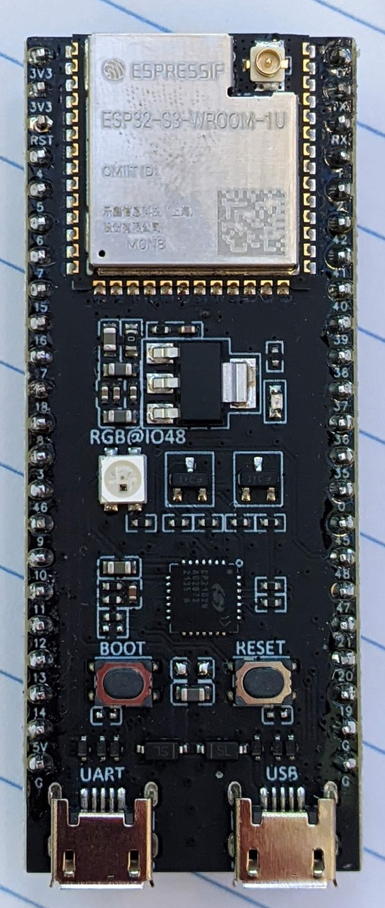
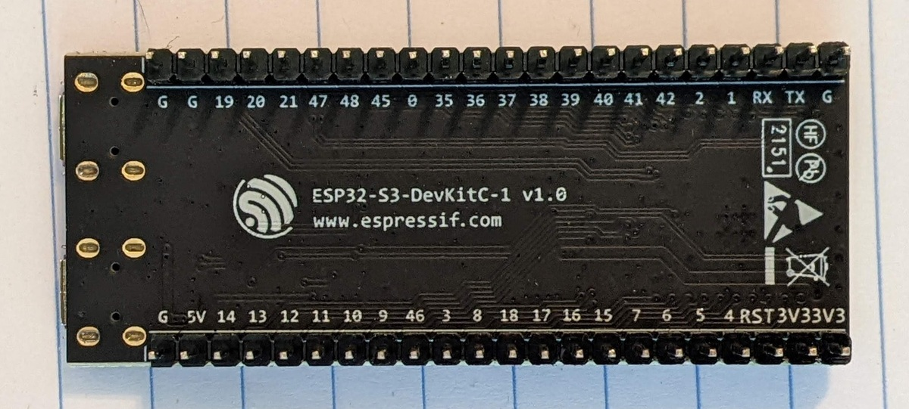
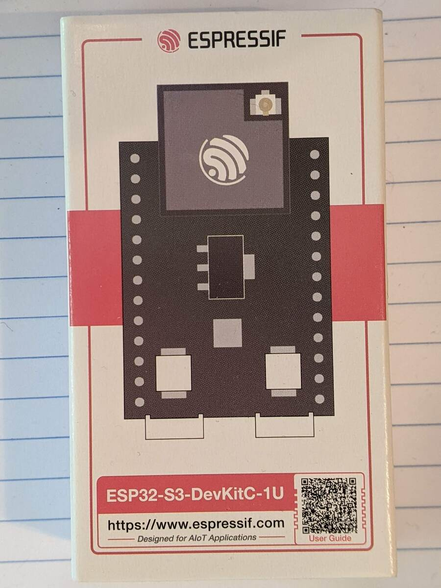
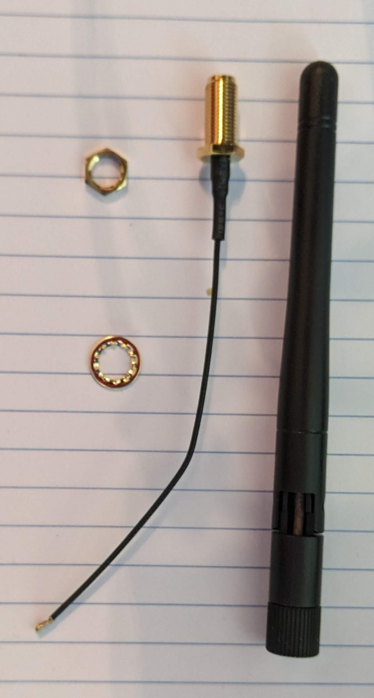
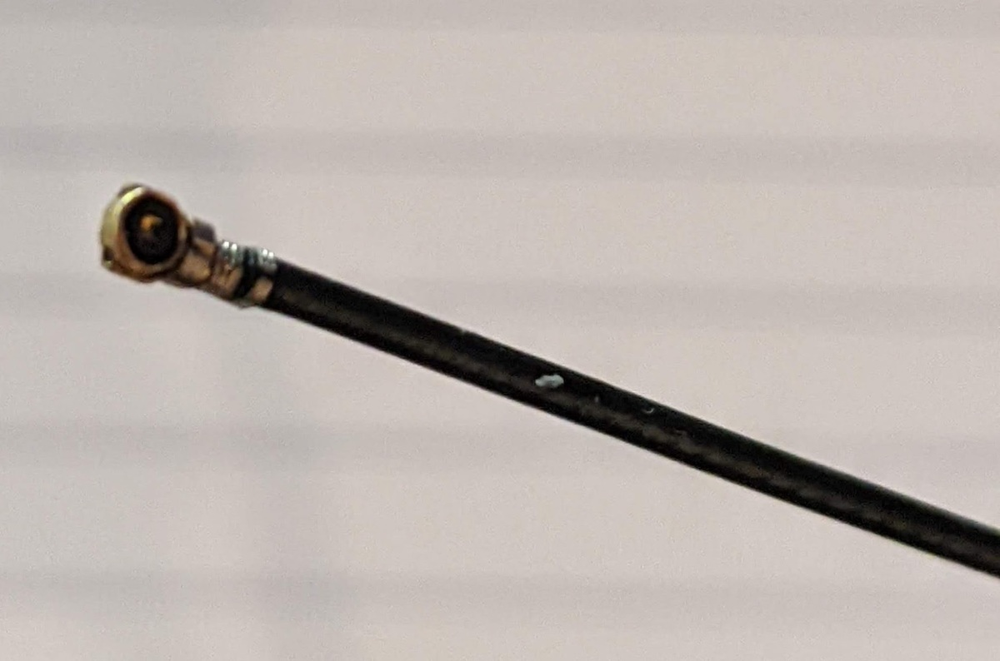
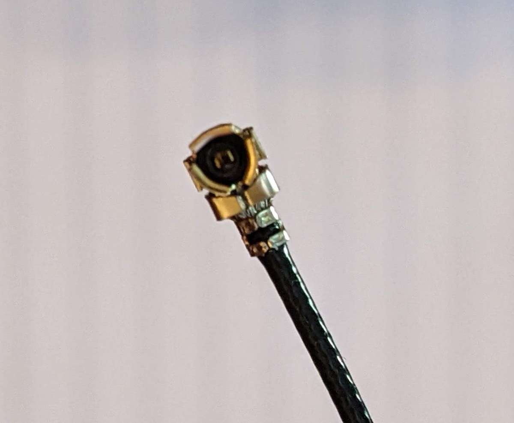
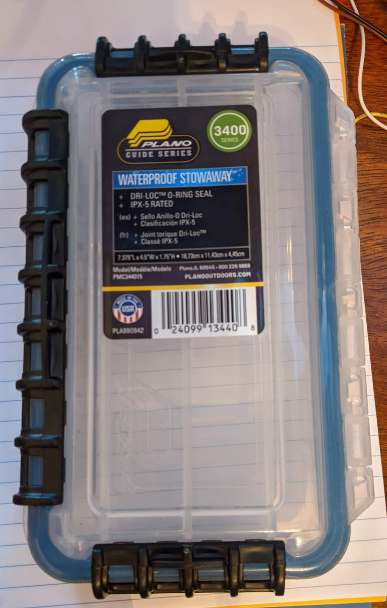
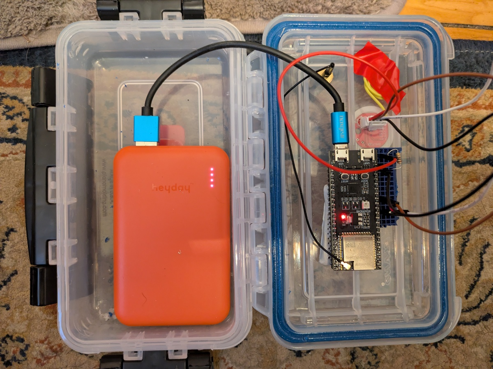
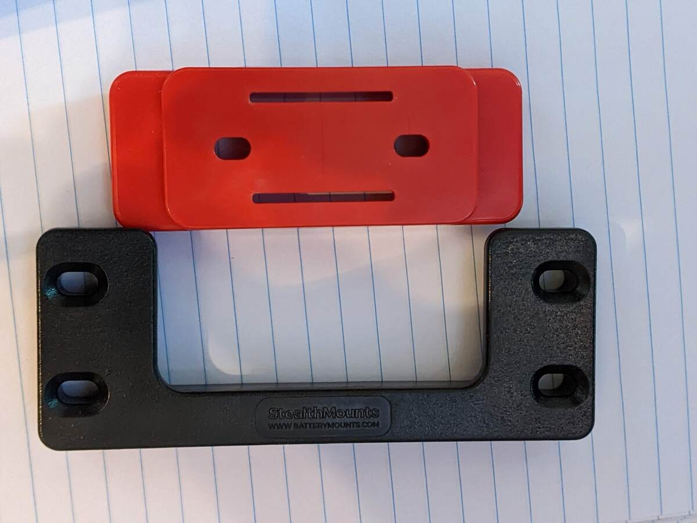
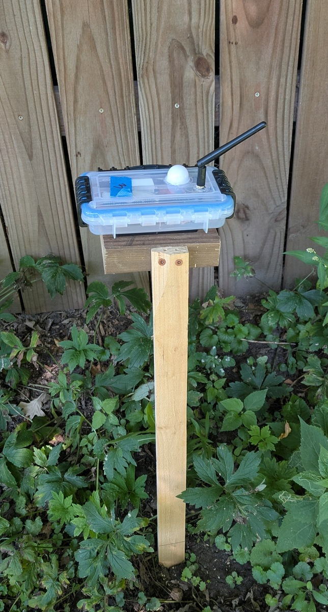

# Sensor Hardware V2

After doing some research, I decided to upgrade to an official ExpressIf development board.  It was a few dollars more per board, but the documentation is much better, and it seemed like the boards were more like to have consistent components.

## New Board

I chose the ESP32-S3-DevKitC-1U-N8 board.  [[Mouser](https://www.mouser.com/ProductDetail/Espressif-Systems/ESP32-S3-DevKitC-1U-N8)].  The "1U" means external antenna, and the "N8" means 8MB of flash memory.

<figure>
  
  <figcaption>ESP32-S3-DevKitC-1U-N8 board, top view.</figcaption>
</figure>

<figure>
  
  <figcaption>ESP32-S3-DevKitC-1U-N8 board, back view.</figcaption>
</figure>

<figure>
  
  <figcaption>The box for the ESP32-S3-DevKitC-1U-N8 board.</figcaption>
</figure>

This is when I learned that different ESP32 boards don't necessarily have the same pin assignments.  Other differences you can see are that there is an additional USB port and an RGB LED light in addition to the first LED light.

The first order of business was to find our new pin assignments.  I decided not to use an LED screen in this version, at least not to start for the following reasons:

1. Save power, since I want this to run on batteries

2. Save money, since I'm spending more per development board now, and 

3. Simplify the code.  I'll be adding calls to transmit to the cloud and this will give me one less thing to keep track of.

These are the old and new pin assignments for the light sensor.

| Sensor Pin | Wire Color | ESP32 Pin             | v1 Board | v2 Board |
| ---------- | ---------- | --------------------- | -------- | -------- |
| **VCC**    | red        | `VIN` (5V)            |          |          |
| **GND**    | black      | `GND`                 |          |          |
| **DAT**    | white      | I²C SDA               | 21       | 8        |
| **SCL**    | brown      | I²C SCL               | 22       | 9        |
| **ADDR**   | yellow     | leave **unconnected** |          |          |

I made the pin assignments configurable in the credentials.ini file in the source code.  (So called because it also contains the WiFi and REST web service credentials.)

I stuck with the same light sensor. 

## WiFi Antenna

I started with a kit containing both the antenna and the pigtail that would connect it to the ESP32 board.  I asked ChatGPT whether a particular antenna kit was compatible with my development board, and it said "sure thing, boss!" [Mouser]  With this kind of foreshadowing, you've probably already realized that something was wrong.  It was the wrong kind of antenna pigtail.  I tried to gently mash the tiny connectors together, but I started to suspect I would break something if I really mashed them.  The connectors are so small, around the size of a sesame seed, that it's hard to see what's going on in there.

<figure>
  
  <figcaption>The WiFi antenna kit with pigtail.</figcaption>
</figure>

When it arrived, I interrogated ChatGPT further about why this had happened.

Me:

> I am looking at some pictures and it looks like the connector on the board is a U.FL male which will need a U.FL female connector.

ChatGPT:

> That's a good observation—but actually, the **U.FL connector on your ESP32-S3-DevKitC-1U board** is still considered a **U.FL female** connector, even though it has a visible center pin. This can be confusing because U.FL connectors use a **snap-on mating system**, not a traditional plug/socket system.
> 
> ##### Why This Confuses People:
> 
> Unlike typical RF connectors like SMA, U.FL connectors don’t clearly signal their gender based on external appearance alone. In U.FL, the **cable-side connector** is always called **male** and the **board-mounted connector** is called **female**, regardless of visible pins.
> 
> ##### What You Need:
> 
> - A cable with a **U.FL male** end (on the side that connects to your ESP32 board).
> 
> - Example:  
>   **U.FL male to SMA female pigtail adapter cable**, if your antenna uses SMA.

This left me thoroughly confused, and I decided that the only way to be sure was to find some pigtails for sale with close-up pictures and visually verify that I had the right connector.  The ones that I found didn't call the U.FL end either male or female; I don't know if that means ChatGPT is right or not.  [[Amazon]](https://www.amazon.com/dp/B0DZTWHNFY)

<figure>
  
  <figcaption>The wrong antenna pigtail connector.</figcaption>
</figure>

<figure>
  
  <figcaption>The right antenna pigtail connector.</figcaption>
</figure>

## Power

I ran into complications when choosing a power source.  I started my research by interrogating ChatGPT.  I wanted to start with a battery power source that:

1. Would provide energy for at least several days

2. Could eventually be converted to also accept solar charging

### TP4056 Module and LiPo Battery

ChatGPT recommended I get a 3.7V 1200mAh LiPo battery [[Amazon]](https://www.amazon.com/dp/B07TWHHCNK), and a TP4056 5V 1A Lithium Battery Charger Module Charging Board with Dual Protection Functions. [[Amazon]](https://www.amazon.com/dp/B07PKND8KG)  I could add a solar panel to keep it charged it at some later date.

When I got to the point that I was successfully sending sensor data via WiFi to my REST API, I decided it was time to hook up the battery.  I had it ready in my hands. I started by interrogating ChatGPT again.  Although I used Gemini for most of my code questions, I found ChatGPT more helpful in higher level questions or questions that required recent knowledge, like information about hardware components.  

Here's the prompt I used.  I had the list of existing hardware and pin hookups ready to go to refresh ChatGPT's memory at intervals.

> Here is my hardware setup.
> Using the 
> 
> - BH1750FVI light sensor
> - ESP32-S3-DevKitC-1U-N8
>   With
> - GND wired to ESP32 ground
> - SCL wired to ESP32 pin 9
> - SDA/DAT wired to ESP32 pin 8
> - VCC pin of light sensor wired to 5V pin of ESP32
>   I have purchased
> - 3.7V 903048 1200mAh Lipo Battery Rechargeable Lithium Polymer ion Battery Pack with PH2.0mm JST Connector https://www.amazon.com/gp/product/B07TWHHCNK
> - HiLetgo 3pcs TP4056 Type-c USB 5V 1A 18650 Lithium Battery Charger Module Charging Board with Dual Protection Functions https://www.amazon.com/gp/product/B07PKND8KG/
>   I would like to hook up the battery and charging board so that my sensor will run off the battery. How should I hook up the pins?

ChatGPT:

> ## ⚠️ Important Reminder:
> 
> - **OUT+ / OUT−** supply unregulated battery voltage — NOT 5V.
> 
> - Feeding that directly into the ESP32-S3-DevKitC-1U-N8’s 5V pin will not work reliably. You'll need a **boost converter** to step up 3.7–4.2V to stable 5V.

ChatGPT responded by telling me that the equipment I had was unsafe unless I also used a Boost Converter.  So I asked it if I could use an existing USB Power Bank, since those already yield 5V, and I had some lying around.

### USB Power Bank

Me:

> In that case, can i just use an external usb battery pack like I would use for any of my electronics?

ChatGPT:

> Yes—using a standard **external USB battery pack** (like a typical phone power bank) is actually the **simplest and safest** approach for your setup.

Wow!  This sounded great.  What I was thinking was

1. I was pretty sure that learning how to work with supplying power on the fly could end up with me destroying my components-- more so than other experiments.

2. Battery packs would be easy for me to swap out and recharge with chargers I already have.

3. They would be safe and tested to provide a constant 5V.

4. I could use them for other things after the project was over; less wasted stuff.

5. You can get them with huge amounts of mAh, so I could power my low-voltage project for ages!

6. I wouldn't have to wait for a power bank to arrive in the mail, so I could start testing immediately.   They're available everywhere.

I'd be giving up some other goals, like sending back the exact voltage left on the battery back to the REST API so I could predict when batteries would run out, but there's always room to swap in my own power circuit and battery later.  

I decided to pick up a couple of inexpensive new power banks to get started. [[Target]](https://www.target.com/p/5000mah-power-bank-heyday-8482-purple/-/A-93042250)

### Power Bank Automatic Shutoff

As it turns out, and as probably should have been obvious, there is a big problem with using USB power banks for powering low voltage projects.  USB power banks turn themselves off when the voltage draw gets too low.  This is ideal if you hook up your phone to recharge and walk away, since it will stop charging your phone when it gets full.  But for a project like mine, the power supply will just seem to die after you walk away.  Also the minimum voltage draw and time before shutting off vary from power supply to power supply. 

I researched (with and without ChatGPT, whom I felt had just burned me) and found some possible workarounds:

1. Add a transistor in parallel with your project that will always draw some current from the battery.  This is a demoralizing solution, because you are purposefully turning some of the power into wasted heat just to keep the power bank on.

2. Add a timer, like a 555 timer to create a periodic pulse of current draw, so that it's not continuous, so it's like #1 but a little less wasteful.

3. Instead of an external timer, use the ESP32 itself to draw more current on a schedule.

I am still working through this problem.  So far I have tried:

1. A 100Ω resistor.  This worked well, but reduced the life of the battery pack.

2. 470Ω, 330Ω, and 220Ω resistors.  The idea is to start with a high resistance and step down.  The higher the resistance, the less current you'll use, and the longer the battery will last.  Unfortunately, all of these had the same low current draw problem, and the battery pack would shut itself off. 

3. A 47Ω resistor.  This caused the power bank to blink its indicator lights and then shut itself off.  I suspect the resistance was so low that it detected it as a short.

4. Turn on the RGB LED onboard the ESP32 at maximum brightness every few seconds.  This was not enough to keep the power bank alive.

The solutions that I've seen for the 555 seem complicated when I have access to all of the functionality of the ESP32 board, so I think I am going to use it to periodically trigger something other than the onboard LED.  For now I have the suboptimal 100Ω resistor solution.  And eventually I will plan for a different power source that can be at least partly charged by solar.   At least for the sensors that aren't completely in the shade.

## Enclosure

Originally I ordered some nice enclosures which are intended specifically for electronics projects, but they were too small to hold a USB power bank.  They also tend to be held shut with screws, and I knew that since these were prototypes I'd probably be opening them up a lot.

I decided to try the Plano Waterproof Stowaway 3400.  It has a gasket and satisfying snap-shut latches.  It's a soft plastic that I could cut holes in for the WiFi antenna and light sensor.  It was a good fit.

<figure>
  
  <figcaption>The Plano Waterproof Stowaway used as an enclosure.</figcaption>
</figure>

I mounted the ESP32's with a combination of mounting putty and cut-down breadboard.  The power banks are held in place with velcro.  The Wifi antenna screws into place, and I sealed the edges of the light sensor with some silicone.

<figure>
  
  <figcaption>The internal layout of the sensor prototype.</figcaption>
</figure>

My biggest splurge, which made me feel a bit ill because I know that a piece of plastic this size is worth a few cents, was a set of Stealthmounts Cleats and Feet, compatible with the Milwaukee Tool packout system.  I don't have a 3D printer, and I was so close to completing this prototype that I didnt' want to spend time woodworking.  I used JB Weld PlasticWeld epoxy to glue the "feet" to the enclosure boxes, and attached the cleats to simple wood staked stands.

<figure>
  
  <figcaption>Stealthmounts Cleat and Foot for mounting.</figcaption>
</figure>

<figure>
  
  <figcaption>The fully assembled sensor prototype on its stand.</figcaption>
</figure>

<figure>
  
  <figcaption>Top view of the assembled sensor prototype.</figcaption>
</figure>

The sensors are now ready to transmit!
