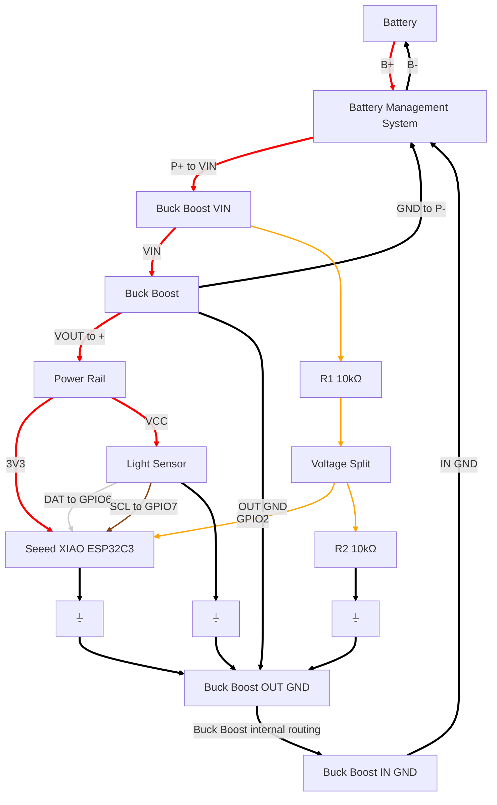
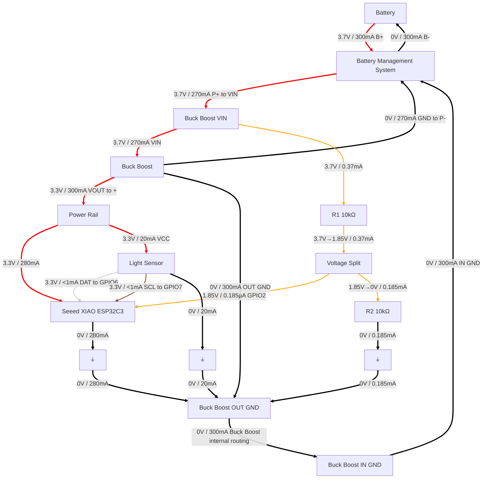

# Sensor Hardware V3

I'm working on the next hardware layout, which will let us eliminate the USB battery packs and monitor the battery charge.

The following diagrams are generated from [Mermaid](https://mermaid.js.org/), a syntax which Claude often uses to define simple diagrams.  I gave it a list of the connections I'd made and let Claude reformat my connections as Mermaid syntax, then let the Mermaid interpreter render the chart.  You can use Mermaid to embed text-only diagram descriptions in your markdown pages in GitHub and they are automatically rendered in the web view of your repository.

[Mermaid does not yet support circuit diagrams](https://github.com/mermaid-js/mermaid/issues/2112), so I am using their flowchart type to represent a graph with edges representing current paths.  I decided to use this because I'm interested in learning more about the usefulness of Mermaid.  Is it a good accessibility tool for users with vision problems, since it has a clear, textual representation?  What kinds of diagrams is it good at?

This isn't a standard circuit diagram, but this format helps me focus on what connections to make.  Some of the diagram nodes represent pins rather than boards.

## Electrical connections

## Electrical connections with estimated voltages and currents

To better understand how current flows through the circuit, I asked Claude AI to give estimates of voltage and current. 

Claude's assumptions:

* ESP32-C3 active current: ~280mA (WiFi enabled, active operation)
* BH1750 sensor current: ~20mA (typical for ambient light sensing)
* Voltage divider current: 0.37mA (3.7V across 20kΩ total resistance)
* Buck-boost efficiency: ~90% (so input current slightly lower than output)
* Battery discharge current: Total system load