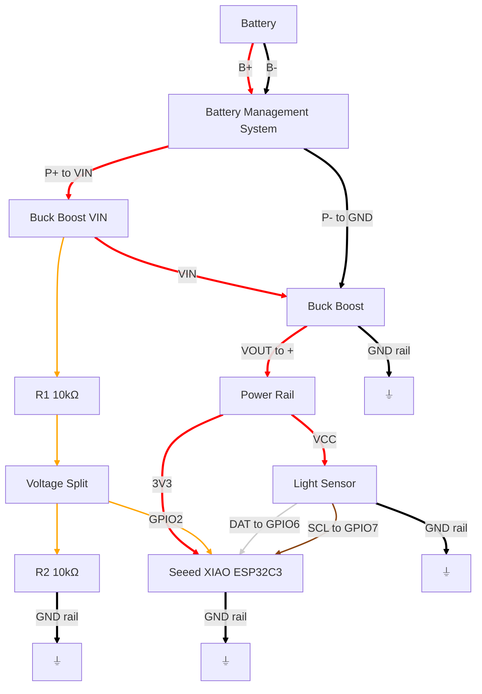
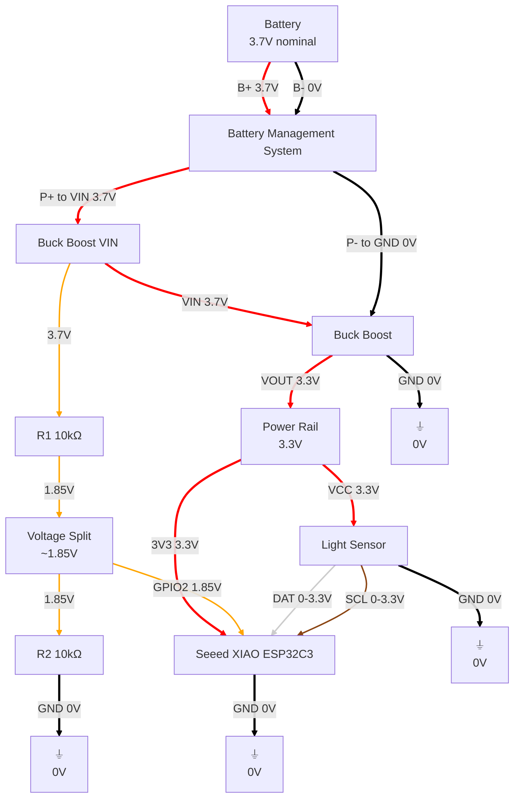
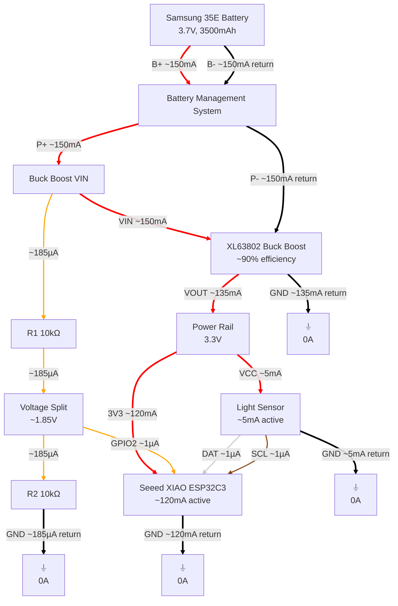

# Sensor Hardware V3

I'm working on the next hardware layout, which will let us eliminate the USB battery packs and monitor the battery charge.

## Electrical connections

## Electrical connections with estimated voltages

## Electrical connections with estimated current

