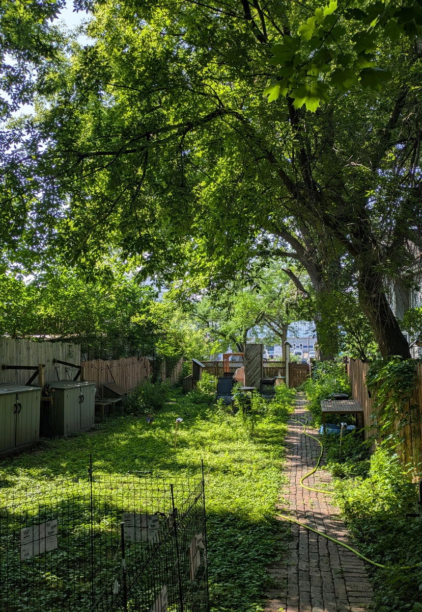
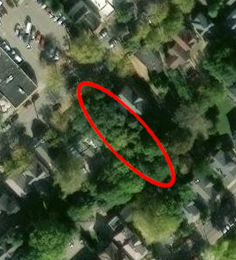
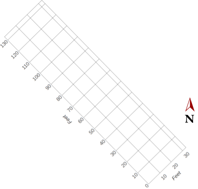
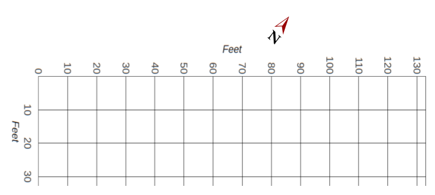

The test site is an approximately 133ft x 33ft lot, located in Madison, Wisconsin, mostly shaded by mature trees along the property lines.

<figure>
  
  <figcaption>Test lot for the Sunlight Sensor project</figcaption>
</figure>

<figure>
  
  <figcaption>Tree canopy of the test lot (Source: <a href="https://earthexplorer.usgs.gov/">https://earthexplorer.usgs.gov/</a> 9/16/2025) </figcaption>
</figure>

I plotted out the test site in 10 foot increments a year ago for a different project.  The (0,0) position is in the southern corner of the lot.

<figure>
  
  <figcaption>North-relative orientation of the lot</figcaption>
</figure>

For the web application, the grid is rotated so that (0,0) is in the upper left, because it seemed like the landscape orientation would be preferable for the [app](https://sunlight.codepaw.com/).

<figure>
  
  <figcaption>Lot orientation for the web application</figcaption>
</figure>
