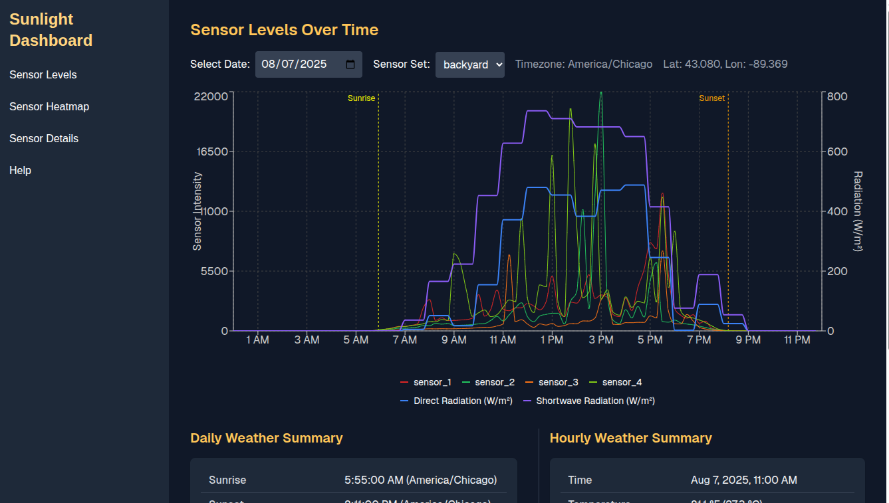
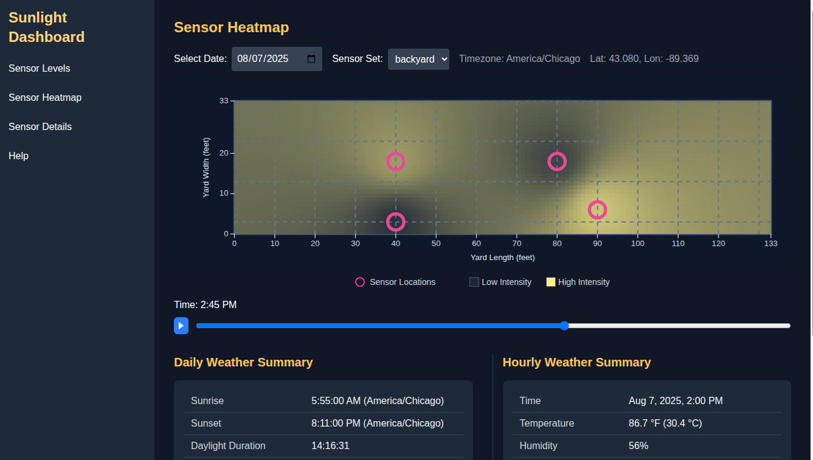
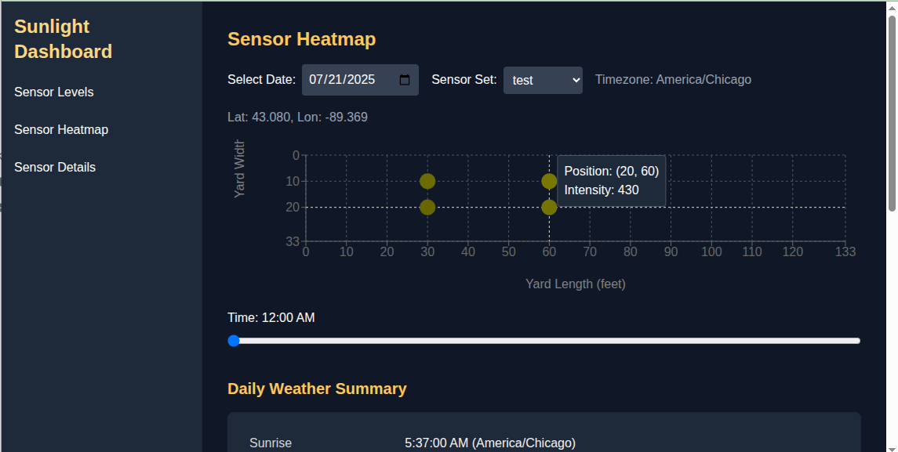
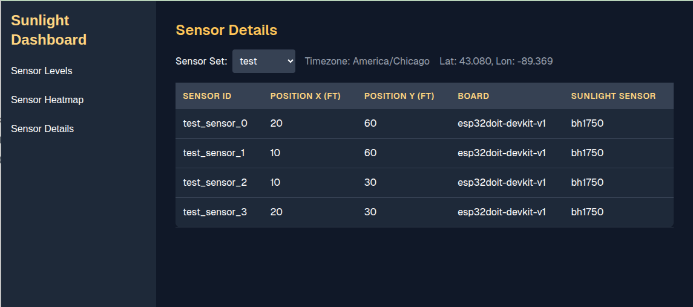

# Web App Screenshots

The web app is written in React, Next.js, and Typescript, hosted in Firebase, and connects to a Firestore backend.

## August 9, 2025
### Sensor Levels

### Sensor Heatmap

## One Month: Minimum Viable Product
### Sensor Levels (pictured here with test data)

### Sensor Heatmap

### Sensor List
